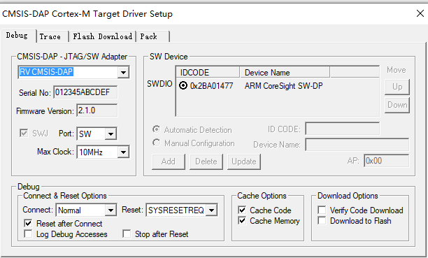
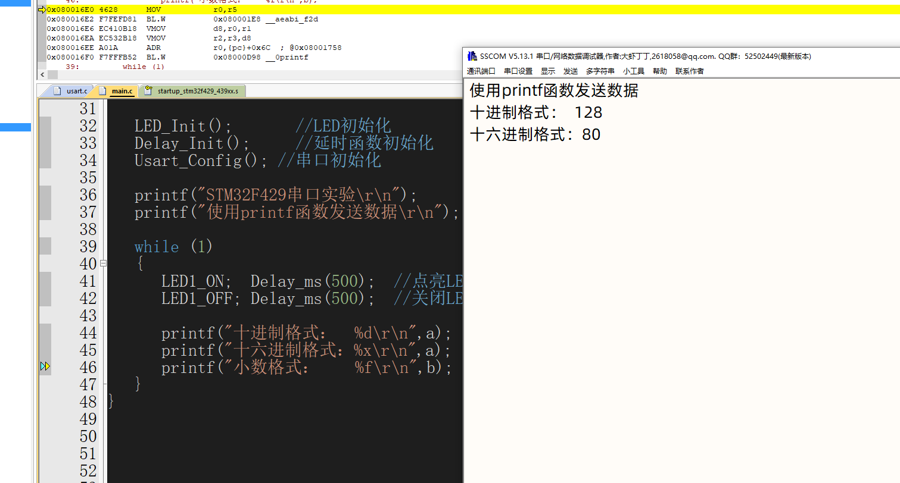

[](LICENSE)
[]()

# BL702 DAPLink

A CMSIS-DAP compliant debugger based on Sipeed RV-Debugger Plus.

## Features

* CMSIS-DAP V2.1
* SWD
* JTAG
* UART
* Connected & Running LED

## Usage

| Function | Label | GPIO |
|:-|:-:|:-:|
| JTAG_TDI | TDI | 0 |
| JTAG_TDO | TDO | 1 |
| JTAG_TMS | TMS  | 2 |
| JTAG_TCK | TCK  | 15 |
| SWD_SWDIO | TMS | 2 |
| SWD_SWCLK | TCK | 15 |
| nRESET | RTS | 24 |
| UART TX | TX | 26 |
| UART RX | RX | 27 |

Notice that 3.3V level I/O is required.

## Compile and download

- Copy config files in config directory into bl_mcu_sdk/bsp/board/bl702/bl702_iot path.
- Execute command.

```

cd bl_mcu_sdk
make APP=usb_daplink APP_DIR=../firmware BOARD=bl702_iot

```

- flash download

```
cd bl_mcu_sdk
make download COMx=COM6
```

## Renderings



